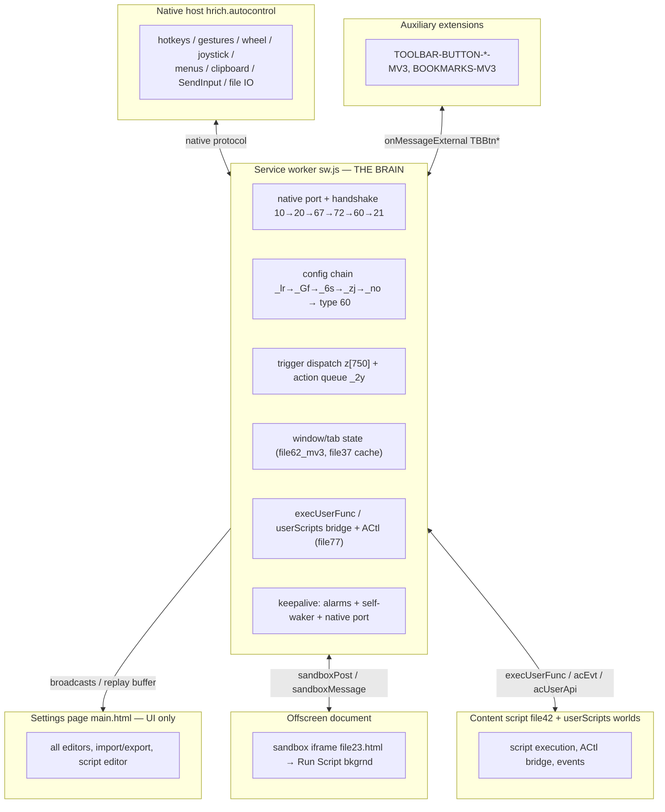

# AutoControl MV3 — Feature Status & Port Compatibility

> **Single source of truth** for the MV2→MV3 port (SW-brain architecture): what is
> ported, what is degraded, what is broken (tracked in §7 with links back
> to this doc), and what is **impossible in MV3 by design** (not tracked).
>
> Verified **2026-08-03** by byte-level comparison of the MV2 baseline
> (`../ext-mv2/`) against `../mv3-build/`, plus official Chrome platform docs
> (webRequest/MV3, `chrome.extension`, `externally_connectable`, favicon).

> **Usage requirement: the MV3 build runs ONLY as an unpacked extension**
> (chrome://extensions → Developer mode → Load unpacked → `../mv3-build/`).
> Not packaged, not Web-Store ready; dev-mode freedoms (userScripts in
> unpacked contexts) are assumed.

Legend: **✅** ported (logic byte-identical to MV2, or an equivalent replacement) | **⚠️** degraded / limited | **❌** broken → §7 (fixable via an MV3-appropriate approach) | **🔒** impossible in MV3 by design (NOT tracked)

---

## 0. Architecture — areas of responsibility

**Relationship rules (who is responsible for what):**

1. **The SW is ALWAYS the leader** — config chain and trigger execution live only
   in the SW (`window._leader='sw'`); the settings page is UI-only and never
   executes triggers (`isLeader()` gate in `mv3_native_shim.js`).
2. **Native ↔ SW** speak the original MV2 protocol (constants from `file61.js`;
   `mv3_native_shim.js` + `sw.js` implement the same wire format).
3. **SW → page**: every native message is broadcast (with `_sw` flag, so the
   page's own handlers skip it) and replayed from a buffer to late-connecting
   pages; the page renders UI state only.
4. **Run Script** executes in three worlds, bridged via postMessage/file42/SW:
   USER_SCRIPT (main path), sandbox iframe in the offscreen doc (background),
   MAIN world (runInPageCtx).
5. **Auxiliary extensions** talk to the SW via `onMessageExternal`
   (TBBtnInit/TBBtnClick/btnProps) — works in MV3 without `externally_connectable`.

**File map (../mv3-build/):**

| Area | Files |
|---|---|
| SW glue | `sw.js`, `sw_prelude.js`, `sw_core_bundle.js`, `offscreen.js/html` |
| Native bridge (SW-side file61 replacement) | `mv3_native_shim.js` |
| Core engine (bundle) | file67, file91, file10, file32, file17, file13, file34_mv3, file56, file57, file74, file47, file73, file70, file25, file8, file95, file15, file48, file77, file37, file3, file24, file18, file41, file45, file50, file52, file59, file89, file93, file62_mv3, file26, file49 |
| Scripting engine | `file42.js`, `file23.html` (sandbox), userScripts `jsCode` in sw.js |
| Settings UI | `main.html`, `mv3_shim.js`, file78/78_mv3, file87, file0, file12, file30, file75, file68, file72, file80, file90 (local CodeMirror), file44, file28, file39 |
| Dynamic / not in bundle | file53 (playAudio — ✅ §7-1; the OFFSCREEN document loads it — the SW routes actions there), file43 (injected into tabs on demand), file2 (page-only subscriptions) |

---

## 1. Area A — Native integration

### 1.1 Incoming message types (z handlers, same set as file61.js)

| Type | Purpose | MV3 | Notes |
|---|---|---|---|
| 750 | trigger event (hotkey/gesture/…) | ✅ | `_pg` transform → `_qt` enrichment → `_6y` execution |
| 760 | raw gesture/action stream | ✅ | `y(actionType, actionSpec)` callback |
| 70 | joystick order | ✅ | |
| 721 | window mapping (hWnd) | ✅ | |
| 730 / 740 | clipboard list / format | ✅ | |
| 735 | window minimize/unminimize | ✅ | |
| 710 | callback resolution (e + l) | ✅ | `postWithCb` matches `e` |
| 800 | errors | ✅ | special classification ported 2026-08-10 (no-hook-notice → notifications with buttons, invalidExtId, APDL→`_r`, segFault→`_uf`) — §7-4 |
| 810 | chunked data (text/list/bin) | ✅ | `_Yi` |
| 704 / 705 | native version / browser name | ✅ | `_Ie`, `_Jh`/`_Kd` |
| 715 | settings sync | ✅ | `_tg` |
| 765 | file size result | ✅ | |
| 905 | keepalive | ✅ | no-op |

### 1.2 Outgoing types & handshake

Handshake order matches MV2 exactly: **10** (file check) → **20** (init) → **67**
(monitors, SW-side `chrome.system.display`) → window enum (335/400) → **72**
(switch states) → **60** (config) → **21** (startup, LAST). Key outgoing types:
40 raw capture, 60 config (mapKey = keyId+22025), 90 gesture icons, 240 file
save dialog, 260 run command, 285/286 clipboard, 300 SendInput, 315 input lock,
905 keepalive, 920 ping. Wire details: `NATIVE_PROTOCOL.md`.

### 1.3 Native component lifecycle

| Feature | MV3 | Notes |
|---|---|---|
| Auto-reconnect with exponential backoff | ✅ | `scheduleRetry` in sw.js |
| **Auto-update of the native .exe** (file check `2` → write `file76.dat` content) | ✅ | `sw.js doHandshake` unpacks the bundled engine (type 250) → poll on the same port → clean reconnect; user-verified 2026-08-04 (~8s). NOTE: the trigger is answer `2` (engine missing/starting), NOT a version comparison — the version arrives separately (type 704/705), same as MV2 `D()` → §7-3 |
| forfiles cleanup of old `.tabs`/`.sess` files | ✅ | `__acForfilesCleanup` in sw.js (2026-08-05): `forfiles /m *.tabs|*.sess /d -10 /c "cmd /c del /F /Q @path"` via type 260, once per SW session (MV2 `!G++`), skipped on `noStupEvt` — engine cmd CWD verified == data dir (§7-11) |

---

## 2. Area B — SW brain: triggers & actions

All trigger compilation (file3/`_mh`), URL transform (`_pg`/`_su`), dispatch
(file37/`_6y`, file8, file25, file95) and all 52 action editors (`file72.js`)
are **byte-identical** to MV2 → full parity, except the items listed below.

### 2.1 Triggers

| Trigger family | MV3 | Notes |
|---|---|---|
| Keyboard shortcuts (incl. sequences, hold, repeats) | ✅ | native-recognized |
| Mouse buttons / clicks (L/R/M/4th/5th, double-click) | ✅ | native |
| Wheel (up/down, vertical/horizontal) | ✅ | native; eventId 512/1536 |
| Mouse gestures (RCM drag etc.) | ✅ | native pattern recognition + MV3 fixes v6/v7 (`Docs/archive/RIGHT-CLICK-ISSUE.md`) |
| Rocker gestures | ✅ | native |
| Joystick | ✅ | native (type 70); not live-tested |
| Voice | ✅ | native; not live-tested |
| Bookmark shortcuts (folder / URL) | ✅ | |
| Browser events (tab open/close/audio, window events) | ✅ | file62_mv3 listeners → type 750 |
| Omnibox (address-bar shortcuts) | ✅ | native |
| Startup | ✅ | |
| Closed tabs / tab lists / MRU | ✅ | |
| Hover-sensitive regions | ⚠️ | **ALL regions broken in Chrome 148+** (native a11y hit-test regression — the native ignores `{type:14}` mouseOver preconds entirely; verified 2026-08-30 on Chrome 150: "Web page" and "Title area" fire everywhere) — affects MV2 and MV3 equally, NOT a port loss; no extension-side workaround (no cursor-position API) |
| Clipboard change | ✅ | |
| Binary switches (incl. context-menu items) | ✅ | |
| Timer | ✅ | |
| Action menus / menu selection | ✅ | |
| Wildcard combos | ✅ | advOpts: none / other devices / any device |
| Preconditions (URL/domain/path, chromeState, caretState, menuState, mouseOver, keyStateChange, actionState, prevSeqStep, tab filters) | ✅ | compiled into type 60 |

### 2.2 Actions

**Tabs:** Activate ✅, Reload ✅, Go back/forward ✅, Go upper URL ✅, Load URLs ✅,
Highlight/select ✅, Pin ✅, Zoom ✅, Mute ✅, Move ✅, Detach ✅, Group ✅,
Duplicate ✅, Open in incognito ⚠️ (requires incognito access — same as MV2),
Close ✅, Reopen/undoClose ✅ (sessions), Unload/discard ✅, Favorite lists ✅,
Alter target tabs ✅

**Windows:** Focus ✅, Move/Resize ✅ (native 400/335), Fit to grid ✅, Tile ✅,
Minimize/Maximize/Restore ✅, Fullscreen ✅, Hide ✅, Scroll ✅, Stay on top ✅,
Send to bottom ✅

**Bookmarks:** Open bookmarks ✅, Bookmark tabs ✅, Bookmark URL ✅

**Menus:** Open menu ✅ (native-rendered; icon pipeline re-implemented in SW with
OffscreenCanvas), Close menu ✅, Move item mark ✅, Select menu item ✅

**Clipboard:** Cut/copy ✅, Paste ✅, Put ✅, Copy hovered URL ✅, Copy selected
URLs ✅, Extract URLs ✅, Text to URL ✅, Erase duplicate lines ✅ — all via
native types 285/286/730/740, same as MV2 (no DOM needed; the old "requires
offscreen" note was wrong)

**System:** Volume ✅, Show desktop ✅, Screen brightness ✅, Screen saver ✅,
Turn off screen ✅

**Other:** Continue chain if ✅, Set switch state ✅, Wait ✅, Insert text ✅,
SendInput ✅ (type 300), Stop sendInput ✅, Run command ✅ (type 260), Run script
⚠️ (see §3), Screenshot ✅ (same as MV2 — `captureVisibleTab` on the activated
visible tab), **Save URL ✅ (all methods — DNR session rules, §7-2)**,
**Play audio ✅ (offscreen doc — §7-1)**, Named actions ✅

### 2.3 MV3-specific brain additions (not port losses)

- Companion-trigger dedup (native fires 14+34 pairs; identical action signature
  dropped in a 300 ms window), action-queue overflow cap + 5 s watchdog
  (replaces the MV2 "stuck action" dialog — 🔒 no dialogs from the SW)
- Window-enumeration cache (1500 ms, `chrome.windows.getAll` is ~1 s in SW)
- `storage.onChanged` → live config rebuild (`_Gf`) — script/action edits apply
  without an extension restart
- RCM fixes: v6 `STRIP_RBTN_BLOCK` (soften key 2/1026 blocks) + v7 `RBTN-ESC`
  (synthetic Esc after a gesture) — `Docs/archive/RIGHT-CLICK-ISSUE.md`
- Native message buffer replayed to pages that connect late

---

## 3. Area C — Scripting engine (Run Script + ACtl API)

### 3.1 Execution paths

| Path | Used for | MV3 | Notes |
|---|---|---|---|
| `chrome.userScripts.execute`, world `USER_SCRIPT` | main path for page scripts | ✅ | requires Chrome 120+ and the "Allow user scripts" toggle (ON for unpacked); works on strict-CSP sites; toggle-off cached, no retries |
| `file23.html` sandbox iframe (eval allowed) | background scripts (`bkgrnd`) | ✅ | hosted in the offscreen document → works even without the settings page |
| `scripting.executeScript` + MAIN-world eval wrapper | fallback when userScripts unavailable | ⚠️ | only on pages without strict CSP; `matchAboutBlank` is NOT a valid target |
| `userScripts.execute`, world `MAIN` | `runInPageCtx` | ✅ | CSP-safe (TamperMonkey-style; API-injected code bypasses the page's inline-CSP check) |

### 3.2 ACtl API — full compatibility table

| Method | Purpose | MV3 | Notes |
|---|---|---|---|
| `sleep(ms)` | pause | ✅ | |
| `var(name[, value])` / `pubVar` | user variables (get/set/delete, publish) | ✅ | |
| `getScript(name)` | return script source | ✅ | |
| `include(path[, type][, again])` | inject css/js into the page | ✅ | |
| `import(path)` | load an ES module | ✅ | rounds 12–13: world CSP (`blob:`/`data:`) + module transport marker |
| `getFile(path[, format])` | load file: text/json/xmlDoc/htmlDoc/html/css/module | ✅ | |
| `saveFile(path, data[, opts])` | write file (native type 220) | ✅ | |
| `saveURL(url, path)` | download URL (native write) | ✅ | NOT affected by the GUI saveUrl gap (§7-2) |
| `getTabIds(spec[, includeHidden])` | resolve tab specifier → ids | ✅ | |
| `getTabInfo(spec)` | map tabId → info | ✅ | |
| `runInTab(spec, func[, args])` | run code in tab(s) | ✅ | fixed rounds 5–7b (x.__cur chain + noWait): returns the real result (e.g. URL); requires file42 in the target tab (manifest content script since round 8, on-demand fallback otherwise) |
| `runInFrames(spec, filters, func[, args])` | run code in frames | ✅ | fixed 2026-08-10 (`sender.frameId` → `frameIds:[frameId]`): subframes run in their own frame; per-frame dedup keys + cold-start retry. `runInPageCtx` inside a runInFrames func fixed 2026-08-12 (same frameId plumbing through execMainWorld/__acInjectCode — B46) |
| `runInPageCtx(func[, args] \| url[, again])` | run in the page MAIN world | ✅ | execution ✅ (incl. strict-CSP sites); return value **FIXED 2026-08-06 (round 16, single-injection proxy; VM 21:52 PASS 2)** |
| `openURL(url(s)[, opts])` | open tabs / window (normal/popup/incognito, left/right of) | ✅ | |
| `closeTab(spec)` | close tabs | ✅ | |
| `setTabState(spec, states[, mode])` | activate/focus/select/pin/mute/minimize/maximize/restore/fullscreen/hide/topmost | ✅ | |
| `execAction(name\|RegExp[, spec])` | run a configured action / find by title | ✅ | |
| `favoriteTabs(listId[, oper][, spec])` | favorite tab lists | ✅ | |
| `runCommand(cmd[, dir][, show])` | run an external program | ✅ | native type 260 |
| `getClipboard([type][, returnType])` | read clipboard: text/html/files/image | ✅ | via native (285) |
| `setClipboard(data[, format])` | write clipboard: text/html/files/image | ✅ | via native (286); serialization via window-name bridge |
| `captureTab(spec[, returnType])` | screenshot tab(s) | ✅ | same behavior as MV2 (activated visible tab, `captureVisibleTab`) |
| `on(events[, spec], func)` | subscribe to events | ✅ | returns an event Promise; callbacks relayed across worlds (`acEvt`) |
| `off(events[, spec][, func])` | unsubscribe | ✅ | |
| `expand(expr[, spec][, mode])` | placeholder expansion | ✅ | |
| `switchState(name[, state])` | binary switch get/set | ✅ | |
| `getEnv(...)` | environment values / `eventData` | ✅ | |
| `natMsg(...)` | native message | 🔒 | no-op stub in MV2 as well — not a port loss |

### 3.3 Specifiers, events, formats (all ✅, identical to MV2)

- **Tab specifiers**: numeric ids, `#currentTab` / `#lastTab` / `#prevUsedTab` /
  `#leftmostTab` / `#rightmostTab` / `#selectedTabs` / `#mruTabs`, named tab
  selections (TSEs), arrays, `{not | intersect | sameWinAs | <field>:…}` filters.
- **Events (`on`/`off`)**: tabOpen, tabClose, tabActivate, tabUnload, tabLoadBegin,
  tabLoadEnd, tabAudioBegin, tabAudioEnd, tabUrlChange, winOpen, winClose,
  winFocus, winUnfocus, winMinimize, winUnminimize, tabFocus, tabUnfocus,
  tabDeactivate, clipboardChange.
- **File formats (`getFile`/`import`)**: text, json, xmlDoc, htmlDoc, html, css, module.
- **Return types (binary data)**: bin, binary, blob, base64, file, objectUrl,
  dataUri, image, canvas.

### 3.4 Verification

`../Test/SCRIPTING-API-TEST.js` (23 in-browser tests, run via RUN SCRIPT on a non-CSP
page) + `../mv3-build/mh_test.js` (SW harness: bundle load, `_Yh` lexical binding,
XHR shim, userAPI dispatch). Known end-to-end-verified chains: "Download all
images" and "Take a shot" (captureTab → setClipboard → openURL → on →
setTabState → execAction → clpbrdPaste).

---

## 4. Area D — Settings UI (main.html)

| Feature | MV3 | Notes |
|---|---|---|
| All trigger/action editors | ✅ | file68/file72 byte-identical; region labels updated for Chrome 148+ (see §2.1) |
| Script editor (CodeMirror + jshint) | ✅ | local `/res/codemirror/` instead of CDN (CSP/offline-safe) |
| Gesture test / combo editor | ✅ | type 40 raw capture + 760 stream |
| Toolbar button editor (up to 8, icons, title) | ✅ | icon pipeline (`_6t`/`_Fh`/`_zr`/`_Ve`) re-implemented in sw.js (OffscreenCanvas) + startup push fixed 2026-08-08 (`_Pk` in configLoaded + button-side `TBBtnInit` retry, mh_test B29) |
| Local sync (off/same browser/all browsers) | ✅ | storage.local copying |
| Remote sync (off/on/compressed) | ✅ | storage.sync |
| Import/Export settings (.acs/.dat), open settings file | ✅ | + import merge fix (file17: entities missing from the imported file are kept) |
| Optional-permission requests | ⚠️ | bookmarks/sessions/notifications/downloads ✅; `background` 🔒 (permission does not exist in MV3) |
| Uninstall native component / Emergency repair / context-menu switches | ✅ | Emergency repair = SW repair broadcast (§8) |
| Toasts / `_Cr` badge | ✅ | badge on the toolbar icon works in the SW (Emergency Repair Wait/OK/Error); the file71.html floating popups work from the SW since 2026-08-12 (`_Fo` → `scripting.executeScript` into the popup tab — §7-15: `_Kg`/`_Ht` REPAIR COMPLETE diagnostics, `_Lh`, `_Uk`); z[800] no-hook uses chrome.notifications by design (proven pattern); chrome.notifications also in use (saveUrl notif, protected-page hint). Remaining: z[800] classification → §7-4 (closed 2026-08-10) |
| Live config apply | ✅ | `storage.onChanged` → `_Gf` in SW — no restart |

## 5. Area E — Data & persistence

Config (`trigActList`, `customEntities`, `sections`), `switchStates`, local/remote
sync, settings-file write via native, managed `policySchema.json` — all ✅,
storage keys and formats identical to MV2. **2026-08-04 (round 18)**: storage
write-back safety — the `_Qj` patch must never fabricate missing keys (a
fabricated `customEntities={}` was written back by `_Mi` and wiped all saved
scripts; fixed + test A14 in mh_test.js).

## 6. Area F — Auxiliary extensions

Toolbar buttons (MV3 builds: `TOOLBAR-BUTTON-MV3`, `TOOLBAR-BUTTON-Pin-MV3`,
`TOOLBAR-BUTTON-Duplicate-MV3`, `TOOLBAR-Tools-MV3`, `BOOKMARKS-MV3`) — ✅:
`TBBtnInit` / `TBBtnClick` / `btnProps` over `onMessageExternal` work in MV3
without `externally_connectable` (per Chrome docs: without the key, all
extensions can connect). Deviation: clicking the **main extension's** toolbar
icon also opens the settings page (two `onClicked` listeners) → §7-7 (fixed 2026-08-08).

---

## 7. Port gaps — broken / degraded

| # | Feature | Status | Notes |
|---|---|---|---|
| 1 | Play audio (GUI action) — hangs the action chain | ✅ | **fixed 2026-08-09** — the bundle's `_7r` lazy-loads file53.js via `_9w` (document.head.appendChild — a NO-OP in the SW): the onload never fired → the generator hung → the action chain + queue `_2y` stalled. And file53 needs AudioContext/speechSynthesis — not in a worker. ⚠ `_Du` is DEEP-FROZEN (file62_mv3.js ends with `_Oo(_Du);` — same as MV2 file62.js): `_Du.action.playAudio.value = …` THROWS, so the runner is intercepted at the LOOKUP — file37 `_rf` reads every action via `_w(name, params)` (writable bundle global, same mechanism as the `_Uu` patch); sw.js wraps `_w` for `"playAudio"` with a runner that completes the action immediately (MV2 semantics) and plays in the **offscreen document** — the REAL file53.js engine is loaded there (lazy: file67.js + polyfills + file53.js) with Web Audio + speechSynthesis; offscreen reasons now include `AUDIO_PLAYBACK` (116+, DOM_SCRAPING fallback). Voice-text templates (`<title>`, clipboard, ...) are pre-expanded IN THE SW (the `_Tt/_up/_ai/_qd/_Yp` machinery lives in the bundle); the offscreen gets the final plain text + usesTabs:false. Native calls from the offscreen (type 255 file reads via the bundle `_If` — chunked reassembly is bundle-internal; type 294 system sounds raw) bridge via `{cmd:"acPlayNative"}`. Polyfill gotchas: `_we` is a `const` (lexical — NOT `window._we`); `_ai` must return a callback RUNNER (yield machinery); `_If` failure resolves `{content:""}` (a falsy d would throw inside the sound queue and stall it). mh_test A5/A5b (incl. runtime probe); sims: `Test/_ac_audio_smoke.js`, `Test/_ac_voice_sim.js`. NO bundle rebuild (sw.js + offscreen.js outside the bundle) |
| 2 | Save URL, methods `notif`/`copy` (method `dwnlApi` works) | ✅ | **fixed 2026-08-09** — MV2 spoofed the Referer header via blocking webRequest (onBeforeSendHeaders + `"blocking"`), unavailable in MV3 (no webRequest/webRequestBlocking permissions) → the listener line THREW in the SW → file49 `H()` returned `{}` → EVERY notif/copy save failed with httpError. FIX: `H()` now installs a **declarativeNetRequest SESSION rule** (`modifyHeaders` → `set` Referer = `_1u(u)||_xu(u)`) before the fetch and removes it in `finally` — DNR rules DO apply to `fetch()` made in the extension's own service worker (Chrome docs, "Interactions with service workers"). Requires `declarativeNetRequestWithHostAccess` permission in the manifest (no new install warning — `<all_urls>` host perms already present). If DNR is unavailable/rejected the fetch proceeds WITHOUT the referer (plain download) instead of `{}` — still an improvement. file49.js IN the bundle → rebuilt (240719, arrow OK). mh_test A6 (source checks + manifest permission + removeRuleIds cleanup). VM-verified 2026-08-09 (user) |
| 3 | Native component auto-update (version mismatch → bundled exe write) | ✅ | engine auto-install ported 2026-08-03: `sw.js doHandshake` answers file check `2` by unpacking `file76.dat` (MD5 = distro) and writing the engine via type 250; **clean rewrite 2026-08-04**: removed the `del /Q /F AutoCtrl_*.exe` (native acks type 260 when cmd.exe STARTS, ~7ms — the async del deleted the fresh engine: "flashed and vanished"); flow is now poll → unpack → poll on the SAME port (MV2 D(true) style) → one clean reconnect → give up with guidance. No del/nuke/reload/infinite loop; verified end-to-end ~8s. Zero-proxy chain stays: manifest MUST point at `AutoControlZero.exe` (proxy/launcher, spawns the engine with arg 152) — no-Zero is impossible (engine crashes standalone). |
| 4 | z[800] error classification: no-hook-notice dialog, invalidExtId, APDL→`_r`, segFault→`_uf` | ✅ | **fixed 2026-08-10** — full MV2 `E()` port into mv3_native_shim.js z[800]: no-hook-notice → `_uf` counter + a **chrome.notifications notice with buttons** after 5 notices in 15s (unless disabled via noHookConflictMsg; localStorage is in-memory in the SW → the notice can re-arm after an SW restart — rare path, acceptable). ⚠ UPDATED 2026-08-12: the MV2 `_Lh` file71.html popup NOW works from the SW (`_Fo` → `scripting.executeScript` — §7-15); z[800] keeps chrome.notifications by design (proven pattern, buttons + no DOM needed). `_Zw` (monitor map) is populated at startup via `_Sf` (VM 22:13 fix). invalidExtId → `_2u()` install-age gate; APDL → sets `_r` (idle type-790 ping stops); NH-error 0xC0000005 → `_uf("segFault")`; everything else → `_Ot` (telemetry gate). Bundles rebuilt (248016 → 248785 → 250736, arrow OK). mh_test A2b: source checks + runtime smoke (78 pass / 0 gaps / 0 FAIL; the smoke surfaced a HARNESS bug — storage.local.get stub returned a node-realm `{}` without file67's Object.prototype.sc → _Mi flush crashed; the stub now returns an in-realm object) |
| 5 | `ACtl.runInFrames` — subframes silently skipped | ✅ | **fixed 2026-08-10** — root cause: a subframe's file42 → FN (eval forbidden in isolated worlds, Chrome 133+) → SW `execUserFunc` → `userScripts.execute({frameIds:[0]})` → the funcCode ran N times but ALWAYS in the TOP frame. Fix (sw.js only, no bundle rebuild): `sender.frameId` → `frameIds:[frameId]` — subframe calls execute in their own frame; plain script runs (frame 0) unchanged. mh_test B37. **2026-08-12 (follow-up)**: `runInPageCtx` INSIDE a runInFrames func also ran in frame 0 — sw.js `execMainWorld` now passes `sender.frameId` (`injectDetails = {frameIds:[frameId]}`) and `__acInjectCode` (prelude) supports `details.frameIds` (frameIds and allFrames are mutually exclusive in the target). The return path was already frame-correct (file42 posts `acMainWorldRes` to its own window). Bundle rebuilt (258113 → 258498, arrow OK). mh_test B46 (source + runtime probe: `{tabId, frameIds:[7]}` vs `{tabId, allFrames:true}`) |
| 6 | `ACtl.runInPageCtx(func)` — return value (FUNC branch) | ✅ | **fixed 2026-08-06 (round 16, single-injection proxy in jsCode)** — funcExecLstnr no-oped; `var m=<fn>` injection replaced by one self-contained `/*AC-MV3-PROXY*/` answering `{response,funcName}` from the same context (MV3 world isolation made the W() listener-A/var-B mechanism impossible). VM 21:52 `PASS 2` (+14ms), full reinstall 22:01: 23/23 on old+fresh tabs |
| 7 | Toolbar icon click always opens the settings page too | ✅ | **fixed 2026-08-08** — sw.js onClicked listener REMOVED; the bundle file62_mv3.js is the single handler (trigger if `brwrAction.trigActId` assigned — legacy key, not reachable via the current UI — else `_sh()` → settings = MV2 semantics). mh_test B25. **VM-VERIFIED**: `trigActId=5` (Next tab) → icon click switches tab, settings do NOT open |
| 8 | file:// URL conditions — SW hardcodes `isAllowedFileSchemeAccess=false` | ✅ | **fixed 2026-08-10** — the prelude passes the REAL `chrome.extension.isAllowedFileSchemeAccess` through (it EXISTS in the MV3 SW; the old shim hardcoded false) → `_id`/`_es`/`_As` (file13) + `Q()` (file77) now exclude file:// tabs from runInTab/runInFrames targets ONLY when the "Allow access to file URLs" toggle is OFF (MV2 parity); toggle ON → file:// targetable. sw.js "fileAcc"/"incogAcc" get real values too. ⚠ The gate is read once per SW load — reload the extension after toggling (MV2 parity). Bundle rebuilt (245807, arrow OK). mh_test A4: GAP → PASS |
| 9 | Toolbar button icons (`_6t` empty set) | ✅ | fixed 2026-08-08: icon generation re-implemented in sw.js (OffscreenCanvas, `swGenGestureIcons`); startup delivery: `_Pk()` on every config-chain completion (configLoaded) + all 5 MV3 buttons retry `TBBtnInit` (2s × 30). mh_test B29, user-confirmed |
| 10 | Page toasts invisible when the settings page is closed | ✅ | **closed 2026-08-09 as obsolete, CORRECTED 2026-08-10, UPDATED 2026-08-12** — `_Cr` is the BADGE (works in the SW); the file71.html popup mechanism (`_Lh`/`_Uk`/`_Kg`/REPAIR COMPLETE) now WORKS from the SW since 2026-08-12 (`_Fo` → `scripting.executeScript` into the popup tab, result via `acPopupResult` message — §7-15); `_nt("showNotif")` is a localStorage flag bridge, not a toast; chrome.notifications in use (saveUrl §7-2, protected pages, z[800] no-hook notice §7-4). Real remainder = z[800] classification → §7-4 (closed) |
| 11 | forfiles cleanup of old `.tabs`/`.sess` files | ✅ | ported 2026-08-05: `__acForfilesCleanup` in sw.js (`forfiles /m *.tabs|*.sess /d -10 /c "cmd /c del /F /Q @path"`, once per SW session, `noStupEvt` skip). Engine cmd CWD verified == data dir via type-260 getStdout listing (`432423.sess` test found) |
| 12 | Hover regions (ALL — "Web page", "Title area", "Browser tab", ...) in Chrome 148+ | ⚠️ | 🔒 native-side (a11y hit-test ignores `{type:14}` mouseOver preconds; verified 2026-08-30 — NOT a port loss; MV2 on Edge works because Edge's a11y differs) — NOT tracked (§8) |
| 13 | `ACtl.runInTab(func)` — returns `[null]` (result lost in relay) | ✅ | fixed 2026-08-05: nested execUserFunc carried the PARENT `trigInstId` without a `~`-suffix → SW dedup key collided with the in-flight parent → BLOCK → `[null]`; `_A` (file48) appends `~`+random to trigInstId IN the message (n() retry keeps the same key → still deduped; the nested call gets a unique key). Bundle rebuilt 233106 |
| 14 | **round-18 storage wipe (FIXED)** — `_Qj` patch used to fabricate `customEntities={}`; `_Mi` wrote it back → ALL scripts/triggers/gestures deleted from storage after `ACtl.var`/`pubVar` | ✅ | fixed 2026-08-04: patch only fills `binSwtch` inside existing `customEntities`; test A14 |
| 15 | file71 popups from the SW (`_Lh`/`_Uk`/`_Kg`/`_Ht`) + post-repair diagnostics (stuck keys / foreign profile) | ✅ | **fixed 2026-08-12** — two independent blockers: (1) MV2 `_Fo` (file70, IN bundle) filled the popup via `chrome.extension.getViews({windowId})` — ABSENT in the MV3 SW (prelude stub `[]`) → TypeError → empty window. FIX (rev 2): `mv3_native_shim.js` overwrites `window._Fo` with `__acMv3Popup` — `windows.create` with a `?runId=N` URL + **content-bridge**: the popup page (`file71.html` + new `file71_bridge.js`, an extension page with full `chrome.runtime` access) requests its content via `chrome.runtime.sendMessage({type:"acPopupContent"})` → sw.js → `__acPopupGetContent` (shim), renders it, auto-sizes the window, and reports the button result via `{type:"acPopupResult"}` → sw.js → `__acResolvePopup` (MV2's getViews+onunload equivalent). ⚠ Rev 1 used `scripting.executeScript` into the popup tab — Chrome REFUSES injection into chrome-extension:// pages ("Extension manifest must request permission to access this host", user VM 2026-08-12 → the window flashed EMPTY). Do NOT go back to executeScript. `onloaded` key-name conversion (`<key>N</key>` → `_Je`) is pre-computed IN the SW. Revives ALL four popups. (2) repair diagnostics DIED with the SW: `showNotif`/`diagnostics` live in the in-memory localStorage shim → `chrome.runtime.reload()` (repair) wiped them → the fresh SW's file34 `_nt("showNotif")` branch never ran. FIX: `__acEmergencyRestartNative` reads the one-shot flags via `_j` BEFORE the reload and persists `__acRepairDiag` to `chrome.storage.local`; the fresh SW (proceedAfterFileCheck) shows `_Kg` (stuck keys + wildcard/Ignore-synthetic-input advice) or `_Ht` (foreign-profile window + report advice) — MV2 semantics. NOTE (user, 2026-08-12): the stuck-keys list is REAL — the user triggered the repair while holding buttons and they were listed. ALSO fixed: the "Emergency repair" context-menu item VANISHED after every config-chain — the `contextMenus.removeAll` patch recreated it via the PATCHED create(), which returns 0 for reloadExtn while `__acCtxMenuOwned` → the recreation was silently dropped; it now uses the ORIGINAL create. Bundle rebuilt (252720 → 258454 → 257053, arrow OK). mh_test B40/B41 (runtime flow) + B42 (persistence). z[800] no-hook keeps chrome.notifications by design (proven) |

| 16 | Site bridge (Import/View/redirSttgs on the site pages) — hostname gate `_mo` only | ✅ | **fixed 2026-08-29** — the `webSettgs` bridge is injected only when the tab hostname matches `_mo` (`www.autocontrol.app`); the site mirror lives on `https://alex-302.github.io/AutoControl_mv3/...` → no interception (and the original domain is dead/bought out). FIX (fork): the gate accepts `_9n="alex-302.github.io"` (file10) via `hostname.in(_mo,_9n)` (file62_mv3); the bridge script is injected with `chrome.scripting.executeScript` + `world:"ISOLATED"` — the port's `_wj`→`__acInjectCode` path runs MAIN-world (userScripts), where `chrome.runtime` is absent and `sendMessage` would throw; ISOLATED restores MV2 semantics (tabs.executeScript). ⚠ FOLLOW-UP (2026-08-29, user test: still dead on an already-open tab): (a) at `document_start` `document.head` can be NULL → `_Zr` now uses `(document.head || document.documentElement)` + try/catch (listener registers first); (b) MV2 re-injected the bridge into ALREADY-OPEN tabs after the config load (`_zg({url:"*://www.autocontrol.app/*"})(c=>c.forEach(d=>_Zr(d.id)))` in file62.js) — the MV3 port lost that block → a tab opened before the SW start (or before an extension reload) never fires onUpdated "complete" again. sw.js `__acReinjectSiteBridge()` (SW start, after importScripts) queries both hosts and `_Zr`-injects each matching tab (github.io filtered to `/AutoControl_mv3/`). ⚠ FOLLOW-UP 2 (2026-08-29, user test: View opens a new tab — correct MV2 semantics — but Import does nothing): file48 `m()` handles `{imprtSttgs:<url>}` via `window._ja(url)`; `_ja`/`_kp`/`_uw`/`_lj` live in file78.js (settings-page UI, NOT bundled) → `window._ja` undefined in the SW → TypeError in the onMessage listener, silent failure. The bundle contains the UI-free pipeline (`_9i` load, `_K` dedupe/renumber, `_4p` merge-add, `_bd` save, `_ku` rebuild → native type 60, `_1p`/`_mg` fetch shim) — sw.js now defines `window._ja` with it (download → JSON.parse → `_Qj({}.add(_2d,data))` → `_K(l,merged,true,true)` → `_4p(l,merged,false)` → `_bd` → `_ku`). No toast in the SW (page-side `_lj` not ported) — import applies silently; settings appear after rebuild. ⚠ FOLLOW-UP 3 (2026-08-29): even with `window._ja` defined, Import still died — file48 `m()` routed `{imprtSttgs}` through `l=_Es(-700,a=>_0j()(c=>_Xp(c)._ja(a)))`; `_0s()` resolves the SETTINGS-PAGE window via `chrome.extension.getViews({tabId})[0]` — EMPTY in the MV3 SW → TypeError before `_ja` is called (silent). `m()` now calls `(window._ja||l)(a.imprtSttgs)` directly (bundle rebuilt 258648 → 258662). ⚠ FOLLOW-UP 4 (2026-08-29, user SW log): `scripting.executeScript` REJECTS `runAt` (only `tabs.executeScript`/`contentScripts.register` accept it) — the bridge injection threw `Unexpected property: 'runAt'` SYNCHRONOUSLY (the `.catch` never fired) → `ACtlExt` never appeared → Import/View silently fell back to the page (download/alert). `_Zr` now uses `injectImmediately:true` (Chrome 102+, the ScriptInjection equivalent of run_at document_start; bundle 258662, arrow OK). SW side (file48 `m()`): `imprtSttgs:<url>` → settings import, `viewSttgs:<url>` → open `main.html?file=…` (new tab → in-tab "Settings File Editor" dialog — MV2 semantics), `redirSttgs:<url>` → update current tab. Bundle rebuilt (258591 → 258648 → 258662, arrow OK). mh_test B47 |

## 8. Impossible in MV3 (by design)

These cannot exist in MV3 in any form. Each has an MV3-appropriate substitute
already in place — or the *feature* it served is planned via a different path
(then it is a §7 item; the constraint itself is not).

| Item | Why impossible in MV3 | Substitute in place / planned |
|---|---|---|
| Blocking `webRequest` (`webRequestBlocking`) | permission unavailable for non-policy MV3 extensions | `declarativeNetRequest` — **done for saveUrl (2026-08-09, §7-2)**: session-scoped `modifyHeaders` rule sets the Referer for the extension's own SW fetch (DNR applies to service-worker fetches); `chrome.downloads` for dwnlApi |
| `eval`/`new Function` in the SW or in content scripts | extension CSP + isolated-world CSP (no `unsafe-eval`) | `chrome.userScripts.execute` (done) |
| Persistent always-running background page with full DOM | MV3 SW lifecycle (SW can be suspended) | SW + alarms/self-waker keepalive + native port + offscreen doc (done) |
| `"background"` optional permission | does not exist in MV3 | SW keepalive (done); the UI request is silently skipped |
| `chrome.extension.getBackgroundPage()` / `getViews()` | removed in MV3 | SW-brain; page-side proxies (done); file71 popups now filled via `scripting.executeScript` into the popup tab instead of getViews (2026-08-12, §7-15) |
| `chrome.tabs.executeScript` / `insertCSS` / `browserAction` | removed in MV3 | `scripting` API + `action` (done) |
| `matchAboutBlank` in `scripting.executeScript` targets | invalid property in MV3 | `allFrames` (no about:blank matching) |
| Modal dialogs from the background context | no DOM/window in the SW | queue watchdog force-shift (done; MV2 "Stop waiting" dialog replaced) |
| Audio/speech APIs in the SW context | no media/DOM APIs in workers | offscreen document — **done for playAudio (2026-08-09, §7-1)**: the REAL file53.js engine + Web Audio + speechSynthesis live in the offscreen doc; the SW routes actions there |
| Old `chrome://favicon/` scheme without permission | requires the `favicon` permission | declared in the MV3 manifest (works) |
| Scripts on protected pages (`chrome://*`, Web Store, `chrome-extension://`, devtools, view-source) | Chrome blocks ALL injection there — content_scripts, `scripting.executeScript`, `userScripts.execute` (identical in MV2 — NOT a port regression; no bypass API exists) | **UX fix done 2026-08-09**: friendly hint instead of the silent FAIL — prelude `__acIsProtectedPage`/`__acProtectedMsg`/`__acNotifyProtected` (bundle top-level), `tabs.executeScript` shim pre-checks the tab URL (instant reject + `chrome.notifications` hint, guarded optional permission), sw.js `execUserFunc` fails fast on `sender.tab.url` + maps the raw rejection. mh_test B36 |

## 9. MV3-only additions (new capabilities)

- Live config rebuild on `storage.onChanged` — script/action edits apply without restart
- Action-queue watchdog (5 s), companion-trigger dedup (14/34), queue overflow cap
- Window-enumeration cache (1500 ms)
- Native message buffer + replay for late-connecting pages
- Offscreen-hosted sandbox → background Run Script works without the settings page
- RCM fixes v6/v7 (`Docs/archive/RIGHT-CLICK-ISSUE.md`)
- Local CodeMirror (offline/CSP-safe)
- `userScripts.configureWorld` — relaxed world CSP for `import` (blob:/data:)
- userAPI execution dedup (in-flight + completed LRU keys)

